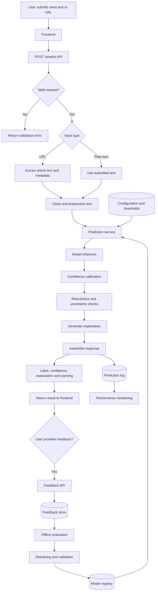
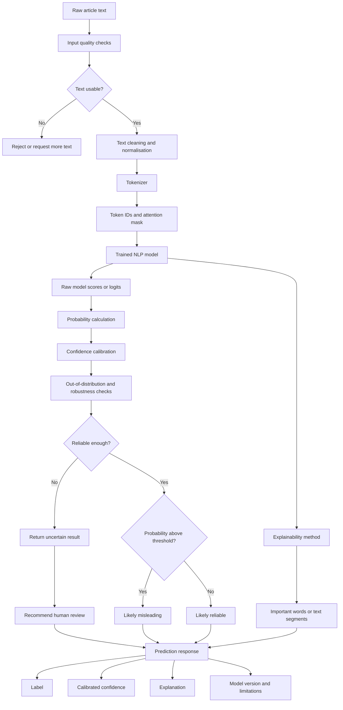

# Fake News Detection Pipelines

## 1. Backend end-to-end pipeline

```mermaid
flowchart TD
    A[User submits news text or URL] --> B[Frontend]
    B --> C[POST /predict API]
    C --> D{Valid request?}

    D -- No --> E[Return validation error]
    D -- Yes --> F{Input type}

    F -- URL --> G[Extract article text and metadata]
    F -- Plain text --> H[Use submitted text]

    G --> I[Clean and preprocess text]
    H --> I

    I --> J[Prediction service]
    J --> K[Model inference]
    K --> L[Confidence calibration]
    L --> M[Robustness and uncertainty checks]
    M --> N[Generate explanation]

    N --> O[Assemble response]
    O --> P[Label, confidence, explanation and warning]
    P --> Q[Return result to frontend]

    O --> R[(Prediction log)]
    R --> S[Performance monitoring]

    T[(Model registry)] --> J
    U[(Configuration and thresholds)] --> J

    Q --> V{User provides feedback?}
    V -- Yes --> W[Feedback API]
    W --> X[(Feedback store)]
    X --> Y[Offline evaluation]
    Y --> Z[Retraining and validation]
    Z --> T
```

## 2. Model prediction pipeline

```mermaid
flowchart TD
    A[Raw article text] --> B[Input quality checks]
    B --> C{Text usable?}

    C -- No --> D[Reject or request more text]
    C -- Yes --> E[Text cleaning and normalisation]

    E --> F[Tokenizer]
    F --> G[Token IDs and attention mask]
    G --> H[Trained NLP model]

    H --> I[Raw model scores or logits]
    I --> J[Probability calculation]
    J --> K[Confidence calibration]

    K --> L[Out-of-distribution and robustness checks]
    L --> M{Reliable enough?}

    M -- No --> N[Return uncertain result]
    N --> O[Recommend human review]

    M -- Yes --> P{Probability above threshold?}
    P -- Yes --> Q[Likely misleading]
    P -- No --> R[Likely reliable]

    H --> S[Explainability method]
    S --> T[Important words or text segments]

    O --> U[Prediction response]
    Q --> U
    R --> U
    T --> U

    U --> V[Label]
    U --> W[Calibrated confidence]
    U --> X[Explanation]
    U --> Y[Model version and limitations]
```
